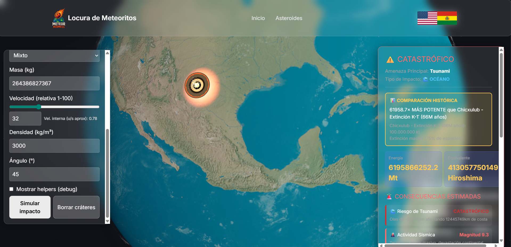

# ☄️ CICADA 3301




## Interactive Planetary Defense Simulation Platform

**NASA Space Apps Challenge 2025: Meteor Madness Challenge**

| Item | Description |
| :--- | :--- |
| **Project URL** | **https://locura-de-meteoritos.vercel.app/** |
| **Live Demo** | **https://locura-de-meteoritos.vercel.app/simulacion** |
| **Tech Stack** | **Frontend:** React, CesiumJS/Three.js (3D Visualization) |
| | **Backend:** Python (Flask), NumPy (Physics Calculation) |
| **Data Used** | NASA NEO API, NASA CNEOS Sentry, USGS (Topography) |

---

## 💡 The Problem

The threat of a Near-Earth Object (NEO) like "Impactor-2025" requires a rapid and informed response. However, there is a **critical gap**:

1.  **Fragmented Data:** Vital information (**NASA** trajectory and **USGS** geography) is scattered across separate APIs and databases.
2.  **Lack of Interface:** Scientists and decision-makers lack a unified and **user-friendly** tool to simulate impact consequences.

The lack of integration prevents accurate modeling of **"widespread devastation"** (tsunamis, earthquakes, shock waves) and paralyzes mitigation planning.

---

## ✨ Our Solution: CICADA 3301

**CICADA 3301** is an interactive visualization and simulation tool that merges spatial and terrestrial data to provide instant risk assessment and mitigation planning.

### Key Features

1.  **Unique Scientific Integration:** Connection to **NASA NEO API** and **CNEOS Sentry** for real asteroid parameters, and **USGS Topography** data to determine impact geographic conditions (land vs. ocean).
2.  **Multi-Consequence Modeling:** Dynamic 3D visualization of **shock wave and heat** radius, plus **Seismic Risk and Tsunami** simulation.
3.  **Mitigation Assessment Module:** Based on **PDCO (Planetary Defense Coordination Office)** strategies. Allows simulating **orbital deflection** and seeing how the impact point shifts.

---

## 🛠️ Technical Detail and Data Usage

The solution is structured as a client (React) and an API server (Python/Flask) that facilitates complex calculations.

### 1. Backend (Python/Flask)

* **Function:** Exposes API *endpoints* for the *frontend*. Performs **physical calculation** of impact (using **NumPy**) and acts as a *proxy* to consume external APIs.
* **Key Data Consumed:** **NASA NEO API** (asteroid parameters) and **USGS elevation** data (to determine land/water).

### 2. Frontend (React)

* **Function:** Interactive user interface and visualization engine.
* **Visualization:** **CesiumJS / Three.js** for 3D representation of the globe, trajectory, and damage layers.
* **Logic:** Sends asteroid parameters to the *backend* and renders the response on the map.

### Key Data Integration

| Consumed Resource | Project Usage |
| :--- | :--- |
| **NASA NEO / CNEOS** | Obtain `diameter`, `velocity` and `coordinates` to feed impact calculation. |
| **USGS Topography** | Determine if impact point is **Land** or **Water** for earthquake/tsunami simulation. |
| **PDCO** | Conceptual base for **Mitigation Module** (orbital deflection strategies). |

---

## 🚀 How to Run the Project

### Prerequisites

* Node.js (for React Frontend)
* Python 3.x (for Flask Backend)
* A valid **NASA API Key**.

### Installation Steps

1.  **Clone Repository:**
    ```bash
    git clone [https://github.com/Locura-de-Meteoritos/Frontend.git]
    cd [frontend]
    ```

2.  **Configure Backend (Python/Flask):**
    ```bash
    cd backend
    pip install -r requirements.txt
    # Configure your NASA API Key in .env or config.py file
    python app.py
    # Flask server will run on [http://127.0.0.1:5000](http://127.0.0.1:5000)
    ```

3.  **Configure Frontend (React):**
    ```bash
    cd frontend
    npm install
    npm start
    # Frontend will open at http://localhost:3000
    ```

---

## 👥 Team and Contributions

| Member Name | Main Role | Contribution Focus |
| :--- | :--- | :--- |
| Elizabeth Suzaño Condori | **Technical Lead, Backend** | Backend Architecture, Impact Calculation Logic (NumPy/Physics), NASA API Integration |
| Jhamil Calixto Mamani Quea | **Frontend Developer, UI/UX** | User Interface Design, Mitigation Module (interface), User Experience |
| Franco Mario Ayala Quispe | **3D Visualization Specialist** | CesiumJS/Three.js Setup, 3D Model Rendering and USGS Layers |
| Omar Quispe Vargas | **Data Scientist / AI Analyst** | Data Research (USGS, CNEOS Sentry), Scientific Model Validation, Impact Reports |
| Yamil Navia Yauli | **Full-Stack Developer / Integrator** | Frontend Feature Implementation, Frontend-Backend Connection, Integration Testing |
| Neytan Sebastian Bustios Garcia | **Frontend Developer / Presenter** | Visual Asset Creation (Logos, Graphics), Pitch Preparation, Visual Documentation (README) |